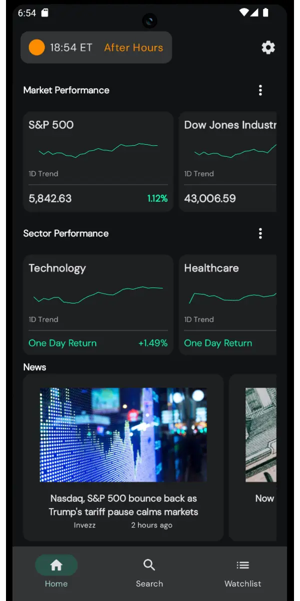
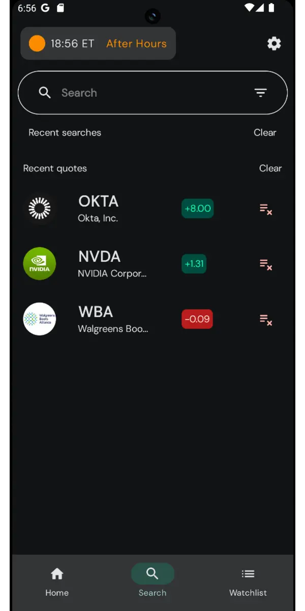
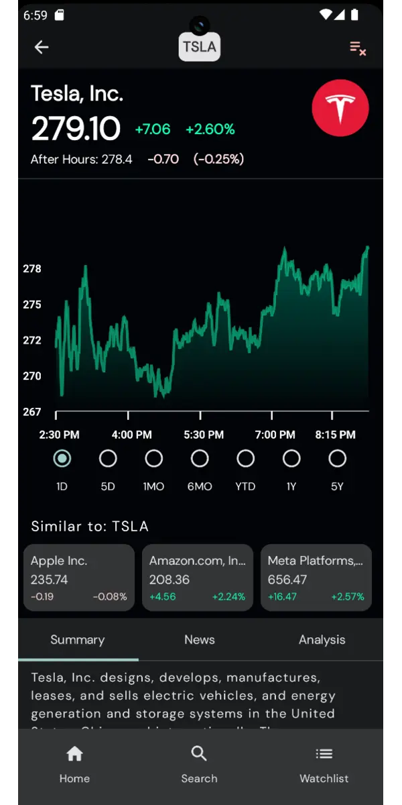
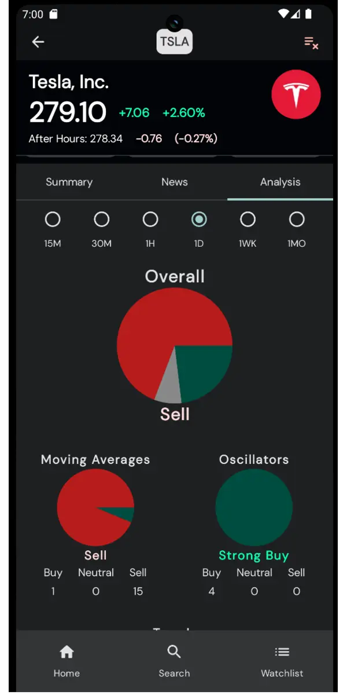
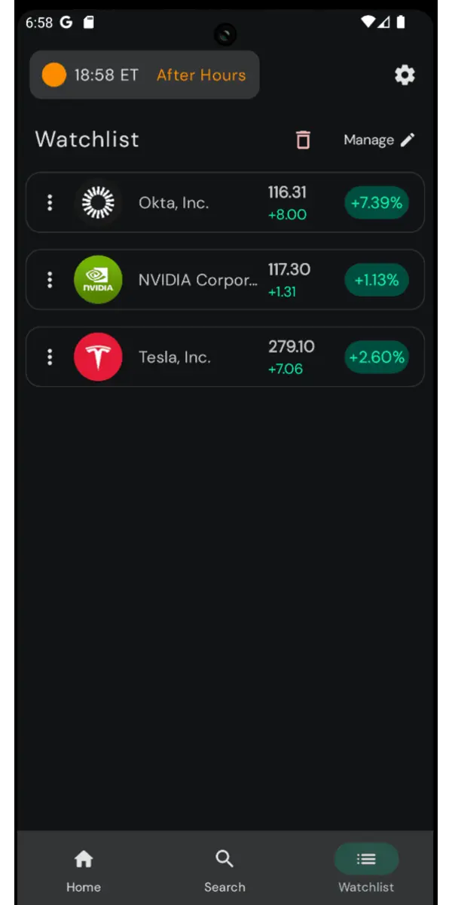

# VerdaxMarket


A production-ready Android financial market tracker showcasing modern development practices. Built with **Jetpack Compose**, **Clean Architecture**, and **modular design** for real-time stock quotes, portfolio management, and market analysis.



## Screenshots

| Home Dashboard | Stock Details & Charts |
|:---:|:---:|
|  |  |
| *Market overview with indices and trending stocks* | *Detailed quotes with interactive price charts* |

| Search & Discovery | Watchlist Management |
|:---:|:---:|
|  |  |
| *Powerful search with suggestions and history* | *Personal watchlists with real-time tracking* |

## Technical Highlights

- **Modern UI**: 100% Jetpack Compose with Material 3 adaptive design
- **Clean Architecture**: Feature-based modular structure with MVVM pattern
- **Dependency Injection**: Dagger Hilt with custom scopes and qualifiers
- **Reactive Programming**: Kotlin Coroutines with Flow for real-time data streams
- **Local Storage**: Room database with Proto DataStore for preferences
- **Network Layer**: OkHttp and Kotlinx Serialization
- **Build Optimization**: Custom Gradle convention plugins and version catalogs

## Architecture

**Modular Clean Architecture** with feature-based separation and dependency inversion principles.

```
app/                    # Application orchestration
├── core/              # Shared infrastructure
│   ├── data/         # Repository pattern & data sources
│   ├── database/     # Room entities & DAOs
│   ├── network/      # Retrofit clients & DTOs
│   ├── designsystem/ # Compose components & theme
│   └── domain/       # Business logic & use cases
├── feature/          # UI modules
│   ├── home/        # Dashboard & market overview
│   ├── quotes/      # Stock details & charts
│   ├── search/      # Symbol search & discovery
│   └── watchlist/   # Portfolio management
└── build-logic/     # Custom Gradle convention plugins
```

## Quick Start

```bash
git clone https://github.com/Verdenroz/verdax-market.git
cd verdax-market
```

**Requirements**: Android Studio Hedgehog+ • JDK 17 • API 26+

## Technologies

- **UI**: Jetpack Compose • Material 3 • Navigation Compose
- **Architecture**: Hilt DI • Room Database • Kotlin Coroutines • DataStore
- **Network**: OkHttp • Kotlinx Serialization
- **Search**: Algolia InstantSearch • Real-time suggestions
- **Backend**: Firebase Auth • Realtime Database • Crashlytics • Performance
- **Build**: Custom Gradle plugins • Version catalogs • KSP

## Contributing

1. Fork and create feature branch
2. Follow established architecture patterns
3. Submit pull request

**Development Guidelines**:
- **Clean Architecture** principles with clear module boundaries
- **Jetpack Compose** best practices and Material 3 design
- **Type safety** throughout the codebase

## License

MIT License - see [LICENSE](LICENSE) for details.

## Acknowledgments

- Architecture patterns inspired by [Now in Android](https://github.com/android/nowinandroid)
- Material Design 3 guidelines and best practices
- Android Jetpack and Architecture Components